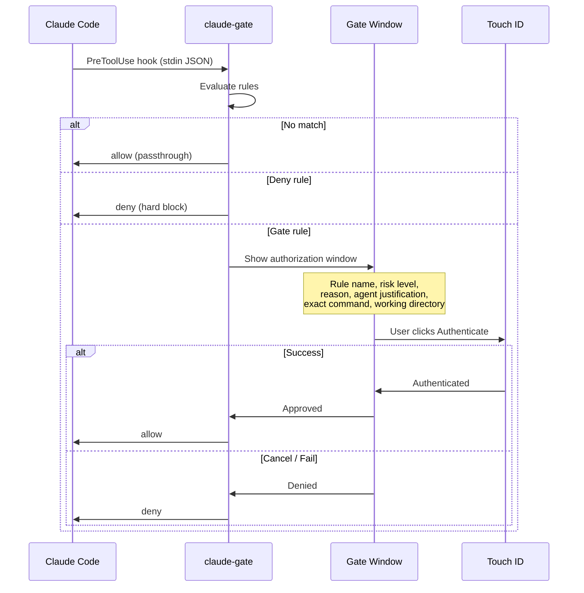
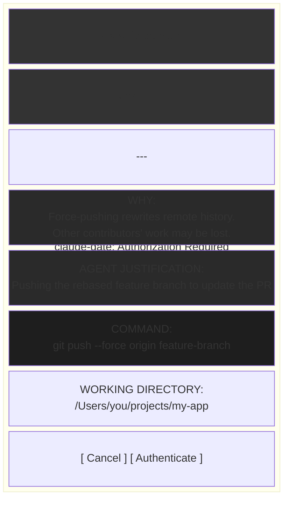
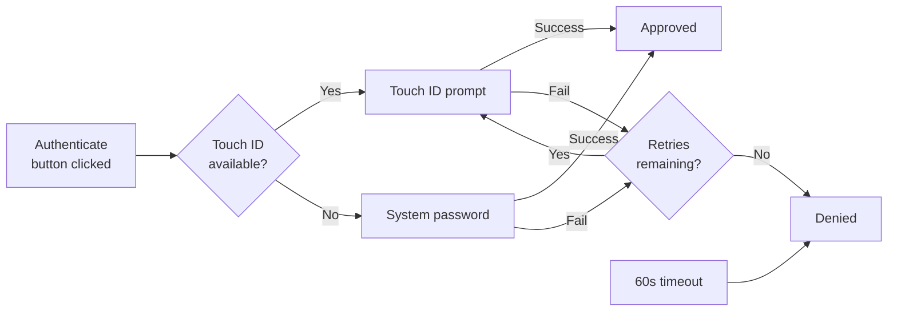
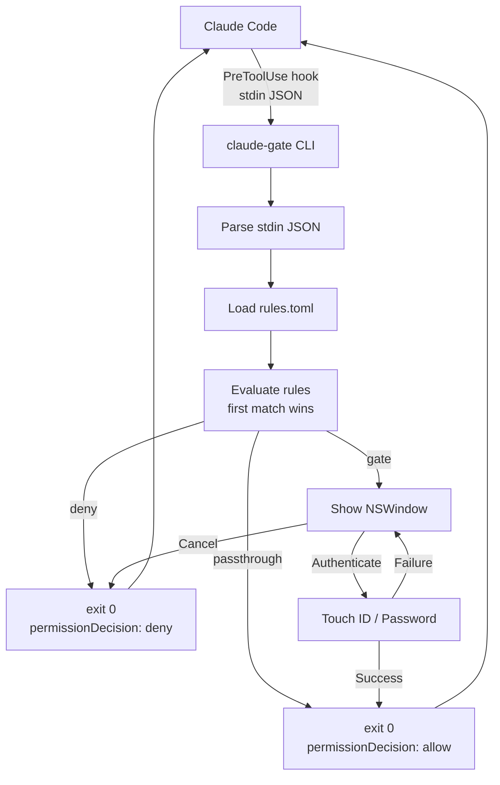

# claude-gate

Biometric permission gating for [Claude Code](https://docs.anthropic.com/en/docs/claude-code). Think `sudo` for AI — but with contextual explanations and Touch ID.

claude-gate intercepts Claude Code tool calls before execution, matches them against configurable rules, and gates dangerous ones behind Touch ID or password authentication. When a gated command is intercepted, it shows Claude's own justification for the tool use alongside the risk explanation.



## Install

Requires macOS 13+ (Ventura) and Swift 5.9+.

```bash
git clone https://github.com/severeon/claude-gate.git
cd claude-gate
./install.sh
```

This will:
1. Build the release binary
2. Copy it to `/usr/local/bin/claude-gate`
3. Seed default rules to `~/.config/claude-gate/rules.toml`

Then add the hook to `~/.claude/settings.json`:

```json
{
  "hooks": {
    "PreToolUse": [
      {
        "matcher": "*",
        "hooks": [
          {
            "type": "command",
            "command": "/usr/local/bin/claude-gate"
          }
        ]
      }
    ]
  }
}
```

## How It Works

claude-gate runs as a [Claude Code PreToolUse hook](https://docs.anthropic.com/en/docs/claude-code/hooks). Every time Claude Code is about to use a tool (run a command, write a file, etc.), claude-gate evaluates the action against your rules:

| Action | What happens |
|--------|-------------|
| **passthrough** | Silently approved. Claude Code continues. |
| **gate** | Native macOS window appears showing the rule reason, Claude's justification for the tool use, and the exact command. Requires Touch ID or password to proceed. |
| **deny** | Hard block. Claude Code is told the action was denied with the rule's reason. |

## The Gate Window

When a rule triggers a `gate` action, a native macOS window appears:



The **Agent Justification** field shows Claude's own `description` of why it's using the tool, giving you context for your decision.

## Rules

Rules live in `~/.config/claude-gate/rules.toml`. They're evaluated top-to-bottom, first match wins (like firewall rules).

```toml
[defaults]
action = "passthrough"   # what to do when no rule matches
timeout = 60             # seconds before auto-action on gate windows
timeout_action = "deny"  # action when timeout expires: deny | passthrough

[[rules]]
name = "Block: recursive delete of system paths"
tool = "Bash"
pattern = 'rm\s+(-[a-zA-Z]*f[a-zA-Z]*\s+|(-[a-zA-Z]*\s+)*)[/~]'
action = "deny"
reason = "This command would recursively delete system-level files."
risk = "critical"

[[rules]]
name = "Gate: force push"
tool = "Bash"
pattern = 'git\s+push\s+.*--force'
action = "gate"
reason = "Force-pushing rewrites remote history."
risk = "high"

[[rules]]
name = "Gate: package install"
tool = "Bash"
pattern = '(npm|yarn|pnpm|bun)\s+(install|add|i\b)'
action = "gate"
reason = "Installing packages pulls third-party code."
risk = "medium"
```

### Rule fields

| Field | Description |
|-------|-------------|
| `name` | Human-readable name shown in the gate window |
| `tool` | Claude Code tool to match: `Bash`, `Write`, `Edit`, or any MCP tool name |
| `pattern` | Regex tested against `tool_input.command` (Bash) or serialized input (MCP tools) |
| `path_pattern` | Regex tested against `tool_input.file_path` (Write/Edit tools) |
| `action` | `passthrough`, `gate`, or `deny` |
| `reason` | Explanation shown in the gate window |
| `risk` | `critical`, `high`, `medium`, or `low` — affects UI color coding |

### Default rules

The shipped defaults are comprehensive, covering 50+ rules across these categories:

| Category | Action | Examples |
|----------|--------|----------|
| System destruction | deny | `rm -rf /`, `mkfs`, `dd if=`, fork bombs, `chmod 777 /` |
| Git shared state | gate | force push, push to main, hard reset, rebase, branch delete |
| Package management | gate | npm/yarn/pip/cargo/brew/gem/go/apt install |
| Credentials & secrets | gate | `.env` access, API keys, SSH keys, keychain |
| Network operations | gate | curl, wget, ssh, scp, netcat |
| System management | gate | sudo, kill, crontab, launchctl |
| Docker operations | gate | `docker rm`, privileged containers |
| Database operations | gate | DROP TABLE, migrations |
| Dotfiles & config | gate | `.bashrc`, `.ssh/config`, `.gitconfig` |
| CI/CD pipelines | gate | GitHub Actions, Jenkinsfile, deploy commands |
| Script execution | gate | `curl \| bash`, eval |

## Authentication

claude-gate uses macOS `LocalAuthentication` framework with the `.deviceOwnerAuthentication` policy:



- **Touch ID** is tried first
- **System password** is the automatic fallback (works on Macs without Touch ID)
- **3 retries** before auto-deny
- **Configurable timeout** (default 60s) with visual countdown in the gate window
- **Configurable timeout action** — `deny` (default) or `passthrough` when timeout expires

## Audit Log

Every decision (passthrough, deny, gate result) is appended to `~/.config/claude-gate/audit.jsonl` as a JSON Lines file:

```json
{"command":"rm -rf /","decision":"deny","reason":"This command would recursively delete system-level or home directory files.","risk":"critical","rule_action":"deny","rule_name":"Block: recursive delete of system/home paths","timestamp":"2026-03-08T00:39:51.201Z","tool_name":"Bash"}
```

Each entry includes: timestamp, tool name, command/file path, matched rule, action, decision, reason, risk level, working directory, and session ID.

## Architecture



Built with:
- **Swift 5.9+** — native macOS frameworks, no FFI
- **AppKit** — native window, no Electron
- **LocalAuthentication** — Touch ID + password
- **TOMLKit** — TOML config parsing
- Uses the correct `hookSpecificOutput` format with `permissionDecision` for Claude Code hook integration

## License

MIT
